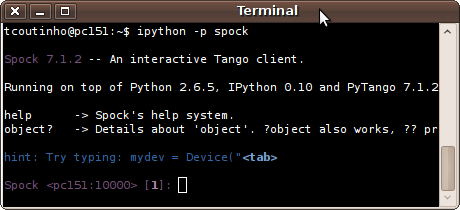

.. PyTango documentation master file, created by
    sphinx-quickstart on Fri Jun  5 14:31:50 2009.
    You can adapt this file completely to your liking, but it should at least
    contain the root `toctree` directive.

.. highlight:: python
   :linenothreshold: 4

Welcome to PyTango |version| documentation!
===========================================

|PyTangoLogoMedium| |spocklogo|

.. sidebar:: Latest news

    2011-04-15:
        PyTango 7.2.0 is out!

    2011-04-14:
        PyTango 7.1.6 is out!

    2011-04-13:
        PyTango 7.1.5 is missing some files. Please don't use this release.
        PyTango 7.1.6 will be released soon.

    2011-04-13:
        PyTango 7.1.5 is out!

PyTango is a python module that exposes to Python_ the complete Tango_ C++ API.
This includes both client and server API.

This means that you can write not only tango applications (scripts, CLIs, GUIs) 
that access tango device servers but also tango device servers themselves, all 
of this in pure Python_.

Check out the :ref:`getting started guide<getting-started>` to learn how to
build and/or install PyTango and after that the :ref:`quick tour <quick-tour>` 
can help you with the first steps in the PyTango world.

If you need help understanding what Tango itself really is, you can check the
Tango_ homepage where you will find plenty of documentation, faq and tutorials.

.. toctree::
    :hidden:

    contents

    
:Last Update: |today|

.. |PyTangoLogoMedium| image:: logo-medium.png
    :align: middle
    :alt: PyTango logo
    

.. _Python: http://www.python.org/
.. _IPython: http://ipython.scipy.org/
.. _Tango: http://www.tango-controls.org/