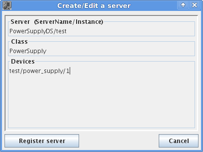

.. _pytango-quick-tour:

Quick tour
==========

This quick tour will guide you through the first steps on using PyTango.

Fundamental TANGO concepts
--------------------------

Before you begin there are some fundamental TANGO concepts you should be aware of.

Tango consists basically of a set of **devices** running somewhere on the network.

A device is identified by a unique case insensitive name in the format 
*<domain>/<family>/<member>*. Examples: `LAB-01/PowerSupply/01`, 
`ID21/OpticsHutch/energy`. 

Each device has a series of *attributes*, *properties* and *commands*. 

An attribute is identified by a name in a device. It has a value that can 
be read. Some attributes can also be changed (read-write attributes).

A property is identified by a name in a device. Usually, devices properties are
used to provide a way to configure a device. 

A command is also identified by a name. A command may or not receive a parameter
and may or not return a value when it is executed.

Any device has **at least** a *State* and *Status* attributes and *State*,
*Status* and *Init* commands. Reading the *State* or *Status* attributes has 
the same effect as executing the *State* or *Status* commands.

Each device as an associated *TANGO Class*. Most of the times the TANGO class 
has the same name as the object oriented programming class which implements it
but that is not mandatory. 

TANGO devices *live* inside a operating system process called *TANGO Device Server*.
This server acts as a container of devices. A device server can host multiple
devices of multiple TANGO classes. Devices are, therefore, only accessible when
the corresponding TANGO Device Server is running.

A special TANGO device server called the *TANGO Database Server* will act as
a naming service between TANGO servers and clients. This server has a known 
address where it can be reached. The machines that run TANGO Device Servers 
and/or TANGO clients, should export an environment variable called
:envvar:`TANGO_HOST` that points to the TANGO Database server address. Example:
``TANGO_HOST=homer.lab.eu:10000``

Minimum setup
-------------

This chapter assumes you have already installed PyTango.

To explore PyTango you should have a running Tango system. If you are working in
a facility/institute that uses Tango, this has probably already been prepared
for you. You need to ask your facility/institute tango contact for the
:envvar:`TANGO_HOST` variable where Tango system is running. 

If you are working in an isolate machine you first need to make sure the Tango
system is installed and running (`Tango howtos <http://www.tango-controls.org/howtos>`_).

Most examples here connect to a device called *sys/tg_test/1* that runs in a 
TANGO server called *TangoTest* with the instance name *test*.
This server comes with the TANGO installation. The TANGO installation
also registers the *test* instance. All you have to do is start the TangoTest 
server on a console::

    $ TangoTest test
    Ready to accept request

.. note::
   if you receive a message saying that the server is already running, 
   it just means that somebody has already started the test server so you don't
   need to do anything.

Client
------

Finally you can get your hands dirty. The first thing to do is start a python
console and import the :mod:`PyTango` module. The following example shows
how to create a proxy to an existing TANGO device, how to read and write
attributes and execute commands from a python console::
    
    >>> import PyTango
    
    >>> # create a device object 
    >>> test_device = PyTango.DeviceProxy("sys/tg_test/1")

    >>> # every device has a state and status which can be checked with:
    >>> print(test_device.state())
    RUNNING

    >>> print(test_device.status())
    The device is in RUNNING state.

    >>> # this device has an attribute called "long_scalar". Let's see which value it has...
    >>> data = test_device.read_attribute("long_scalar")

    >>> # ...PyTango provides a shortcut to do the same:
    >>> data = test_device["long_scalar"]

    >>> # the result of reading an attribute is a DeviceAttribute python object. 
    >>> # It has a member called "value" which contains the value of the attribute
    >>> data.value
    136

    >>> # Check the complete DeviceAttribute members:
    >>> print(data)
    DeviceAttribute[
    data_format = SCALAR
          dim_x = 1
          dim_y = 0
     has_failed = False
       is_empty = False
           name = 'long_scalar'
        nb_read = 1
     nb_written = 1
        quality = ATTR_VALID
    r_dimension = AttributeDimension(dim_x = 1, dim_y = 0)
           time = TimeVal(tv_nsec = 0, tv_sec = 1399450183, tv_usec = 323990)
           type = DevLong
          value = 136
        w_dim_x = 1
        w_dim_y = 0
    w_dimension = AttributeDimension(dim_x = 1, dim_y = 0)
        w_value = 0]

    >>> # PyTango provides a handy pythonic shortcut to read the attribute value:
    >>> test_device.long_scalar
    136 

    >>> # Setting an attribute value is equally easy:
    >>> test_device.write_attribute("long_scalar", 8776)

    >>> # ... and a handy shortcut to do the same exists as well:
    >>> test_device.long_scalar = 8776

    >>> # TangoTest has a command called "DevDouble" which receives a number 
    >>> # as parameter and returns the same number as a result. Let's
    >>> # execute this command:
    >>> test_device.command_inout("DevDouble", 45.67)
    45.67

    >>> # PyTango provides a handy shortcut: it exports commands as device methods:
    >>> test_device.DevDouble(45.67)
    45.67

    >>> # Introspection: check the list of attributes:
    >>> test_device.get_attribute_list()
    ['ampli', 'boolean_scalar', 'double_scalar', '...', 'State', 'Status']
    
    >>> 

This is just the tip of the iceberg. Check the :class:`~PyTango.DeviceProxy` for
the complete API. 

PyTango comes with an integrated IPython_ based console called :ref:`itango`.
It provides helpers to simplify console usage. You can use this console instead
of the traditional python console. Be aware, though, that many of the *tricks*
you can do in an :ref:`itango` console cannot be done in a python program.

Server
------

Since PyTango 8.1 it has become much easier to program a Tango device server.
PyTango provides some helpers that allow developers to simplify the programming
of a Tango device server.

Before creating a server you need to decide:

1. The name of the device server (example: `PowerSupplyDS`). This will be
   the mandatory name of your python file.
2. The Tango Class name of your device (example: `PowerSupply`). In our 
   example we will use the same name as the python class name.
3. the list of attributes of the device, their data type, access (read-only vs
   read-write), data_format (scalar, 1D, 2D)
4. the list of commands, their parameters and their result

In our example we will write a fake power supply device server. The server
will be called `PowerSupplyDS`. There will be a class called `PowerSupply`
which will have attributes:

* *voltage* (scalar, read-only, numeric)
* *current* (scalar, read_write, numeric, expert mode) 
* *noise* (2D, read-only, numeric)

commands:

* *TurnOn* (argument: None, result: None)
* *TurnOff* (argument: None, result: None)
* *Ramp* (param: scalar, numeric; result: bool)

properties:

* *host* (string representing the host name of the actual power supply)
* *port* (port number in the host with default value = 9788)

Here is the code for the :file:`PowerSupplyDS.py`

.. literalinclude:: _static/PowerSupplyDS.py
    :linenos:

The server API :ref:`pytango-hlapi`.

Before running this brand new server we need to register it in the Tango system.
You can do it with Jive (`Jive->Edit->Create server`):

... or in a python script::

    >>> import PyTango
    
    >>> dev_info = PyTango.DbDevInfo()
    >>> dev_info.server = "PowerSupplyDS/test"
    >>> dev_info._class = "PowerSupply"
    >>> dev_info.name = "test/power_supply/1"
    
    >>> db = PyTango.Database()
    >>> db.add_device(dev_info)

After, you can run the server on a console with::

    $ python PowerSupplyDS.py test
    Ready to accept request

Now you can access it from a python console::

    >>> import PyTango

    >>> power_supply = PyTango.DeviceProxy("test/power/supply/1")
    >>> power_supply.state()
    STANDBY

    >>> power_supply.current = 2.3
    
    >>> power_supply.current
    2.3

    >>> power_supply.PowerOn()
    >>> power_supply.Ramp(2.1)
    True
    
    >>> power_supply.state()
    ON

Next steps: Check out the :ref:`pytango-api`.
    
