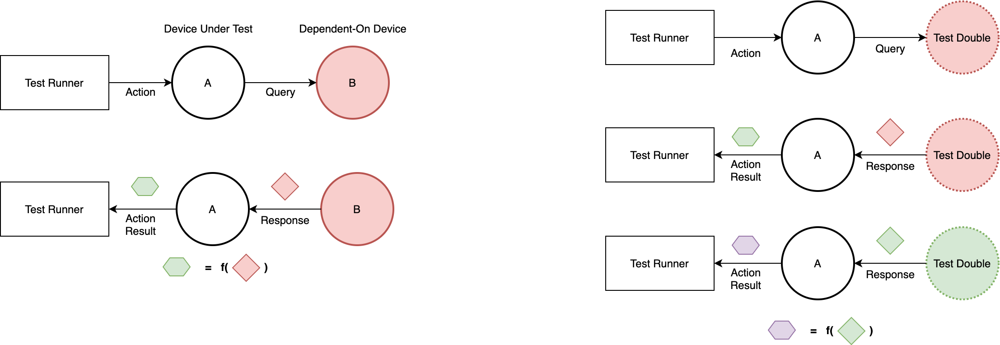
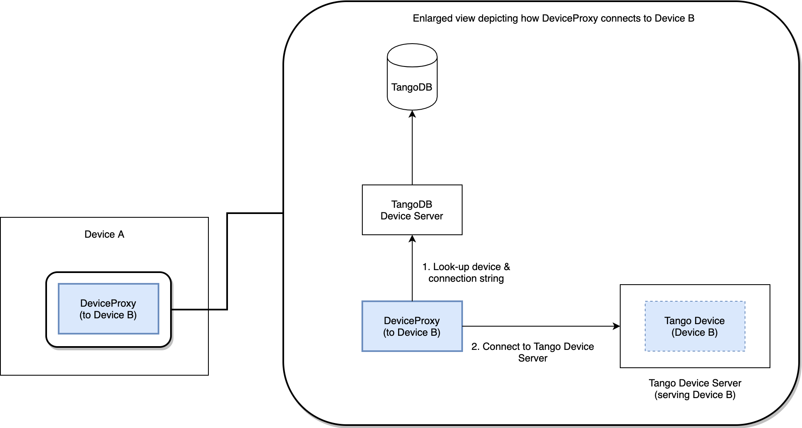
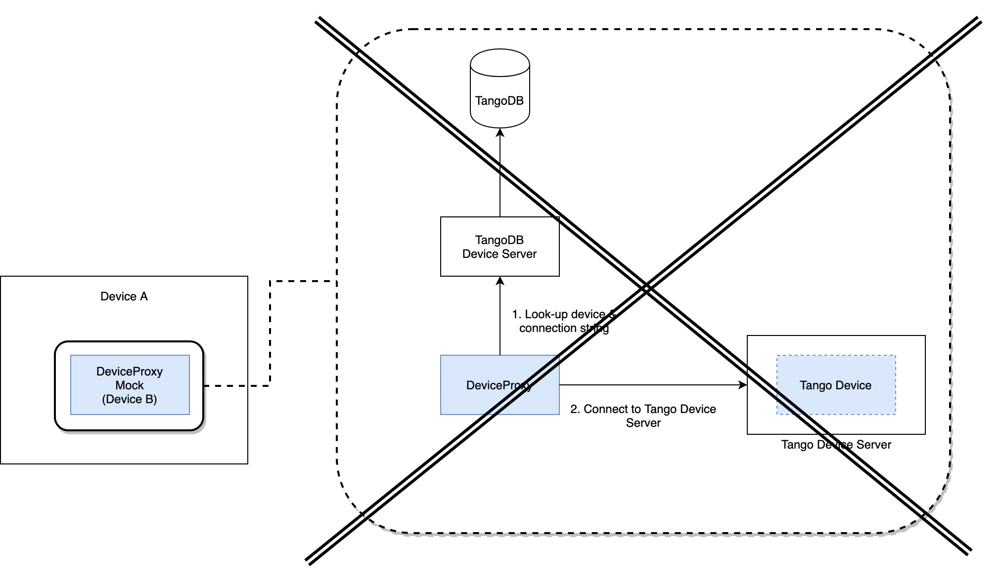
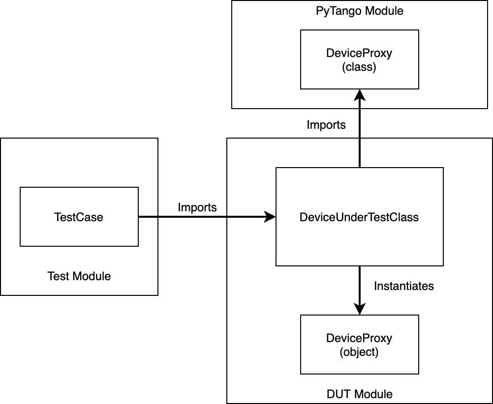
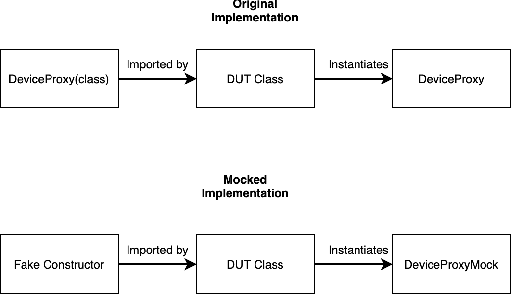

.. currentmodule:: tango

.. highlight:: python
   :linenothreshold: 3

.. _testing-mocks:

===========================
Mocking clients for Testing
===========================

Test Doubles: The idea behind mocking Tango entities
----------------------------------------------------

Suppose we want to test a Tango Device, **Device A**. In particular, we want to assert that when a certain *action* is invoked on **Device A**, it should produce an expected result. This will prove to us that **Device A** 's implementation sufficiently manifests the behaviour we would like it to have.

Now suppose **Device A** depends on **Device B** to complete its action. In other words, the *result* will depend, in part, on the state of **Device B**. This means that to test this scenario, both devices need to be in a base state that we control.

This might be difficult to achieve when using real devices since it might require a lot of orchestration and manipulation of details irrelevant to the test scenario, i.e. to get **Device B** into the required state.

A **Test Double** is a component that can act as a real device but is easier to manipulate and configure into the states that we want during testing. This means that we can replace **Device B** with its **Test Double** as long as it conforms to the interface that **Device A** expects.

What's more, we can manipulate the **Test Double** to respond in the way we expect **Device B** to respond under the various conditions we want to test. A **Mock** is simply a type of **Test Double** that might have some conditional logic or behaviour to help in testing.

Tango's DeviceProxys
--------------------

In Tango, the **DeviceProxy** is an object that allows communication between devices. It can be regarded as the *client* part of a *client-server* interaction.

Thus, any Tango device (say, **Device A**) that depends on a secondary Tango device (**Device B**) will need to use a **DeviceProxy** to connect and communicate with the secondary device (**Device B**).

This invariably means that in the implementation of **Device A**, it will be instantiating and using a **DeviceProxy** object.

However, the mechanism by which this happens is a multi-step process which requires communication with a TangoDB DS and an appropriately configured Tango system that contains a deployed **Device B**.

If we can replace the **DeviceProxy** object that **Device A** will use to communicate to **Device B** with our own Mock object (**DeviceProxyMock**), we can test the behaviour of **Device A** while faking the responses it expects to receive from querying **Device B**.
All this without the need for deploying a real **Device B**, since for all intents and purposes, the **DeviceProxyMock** would represent the real device.

In other words, mocking the **DeviceProxy** is sufficient to mock the underlying device it connects to, with reference to how **DeviceProxy** is used by **Device A**.

Mocking the DeviceProxy
-----------------------

In some **PyTango** devices, such as those in the `SKA TMC Prototype <https://gitlab.com/ska-telescope/tmc-prototype>`_, the **DeviceProxy** object is instantiated during the operation of the **Device Under Test** (**DUT**). Also, there isn't usually an explicit interface to inject a **DeviceProxyMock** as a replacement for the real class.

As an example, the `CentralNode <https://gitlab.com/ska-telescope/tmc-prototype/-/blob/0.1.8/tmcprototype/CentralNode/CentralNode/CentralNode.py>`_ (at v0.1.8) device from the TMC Prototype instantiates all the **DeviceProxy** objects it needs to connect to its child elements/components in its `init_device <https://gitlab.com/ska-telescope/tmc-prototype/-/blob/0.1.8/tmcprototype/CentralNode/CentralNode/CentralNode.py#L246>`_ method::

   class CentralNode(SKABaseDevice):
   ...
     def init_device(self):
       ...
       self._leaf_device_proxy.append(DeviceProxy(self._dish_leaf_node_devices[name]))
       ...
       self._csp_master_leaf_proxy = DeviceProxy(self.CspMasterLeafNodeFQDN)
       ...
       self._sdp_master_leaf_proxy = DeviceProxy(self.SdpMasterLeafNodeFQDN)
       ...
       subarray_proxy = DeviceProxy(self.TMMidSubarrayNodes[subarray])

Unfortunately, the *init_device* method does not allow us to provide the class we want the device to use when it needs to instantiate its **DeviceProxys**.

So we will have to mock the **DeviceProxy** class that the **DUT** imports before it instantiates that class.

The diagram below illustrates the relationship between the TestCase, **DUT** and its transitive import of the **DeviceProxy** class from the **PyTango** module:

So, we want to replace the imported **DeviceProxy** class with our own Fake Constructor that will provide a Mocked Device Proxy for the **DUT** during tests.

In other words, we want to replace the thing that instantiates the **DeviceProxy** (i.e. the constructor) with our own `callable <https://docs.python.org/3.8/reference/expressions.html#calls>`_ object that constructs a mocked **DeviceProxy** object instead of the real one.
We want to move from the original implementation to the mocked implementation shown in the diagram below:

Solution
--------

This can be achieved by using the `unittest.mock <https://docs.python.org/3.7/library/unittest.mock.html>`_ library that comes with Python 3 or the third-party library `mock <https://pypi.org/project/mock/>`_ for Python 2.7.

The *mock.patch()* method allows us to temporarily change the object that a name points to with another one.

We use this mechanism to replace the **DeviceProxy** class (constructor) with our own fake constructor (a mock) that returns a Mock object::

   with mock.patch(device_proxy_import_path) as patched_constructor:
       patched_constructor.side_effect = lambda device_fqdn: proxies_to_mock.get(device_fqdn, Mock())
       patched_module = importlib.reload(sys.modules[device_under_test.__module__])

An alternative to using *mock.patch* is pytest's *monkeypatch*. Its *.setattr* method provides the same functionality, i.e. allowing you to intercept what an object call would normally do and substituting its full  execution with your own specification. There are more examples of its use in the OET implementation which is discussed below.

*proxies_to_mock* is a dictionary that maps **DeviceProxyMock** objects to their associated Tango device addresses that we expect the **DUT** to use when instantiating **DeviceProxy** objects. A brand new generic *Mock()* is returned if a specific mapping isn't provided.

Since the **DeviceProxy** class is defined at import time, we will need to reload the module that holds the **DUT**. This is why we explicitly call *importlib.reload(...)* in the context of *mock.patch()*.

For full details and code that implement this solution, see the following merge requests:

  * https://gitlab.com/ska-telescope/tmc-prototype/-/merge_requests/23
  * https://gitlab.com/ska-telescope/tmc-prototype/-/merge_requests/35

Moving on
---------

Once we mocked **DeviceProxy**, then we can use the constructor of this object to return a device that is fake. This can be:

  * a stub device, programmed to behave in a way that suits the tests that we are writing; in this case we are using the stub to inject other inputs to the **DUT**, under control of the test case;
  * a mock device, a stub device where we can inspect also how the **DUT** interacted with it, and we can write assertions.

The benefits that we can achieve with the technique described here are:

  1. ability to test the **DUT** in isolation
  2. ability to create tests that are very fast (no network, no databases)
  3. ability to inject into the **DUT** indirect inputs
  4. ability to observe the indirect outputs of the **DUT**
  5. ability to observe the interactions that the **DUT** has with the mock.

Using pytest and fixtures
-------------------------

The above mocking techniques can be achieved in a very succint way using pytest fixtures.
Examples of this can be found in the `pytango/examples <https://github.com/tango-controls/pytango/tree/develop/examples/multidevicetestcontext>`_.  And more examples are
available in the last section of the *Unit testing Tango devices in Python* presentation
from the `Tango 2020 November status update meeting <https://indico.esrf.fr/indico/event/49/other-view?view=standard>`_.

Acknowledgement
---------------

Initial content for this page contributed by the `Square Kilometre Array <https://www.skatelescope.org>`_.

