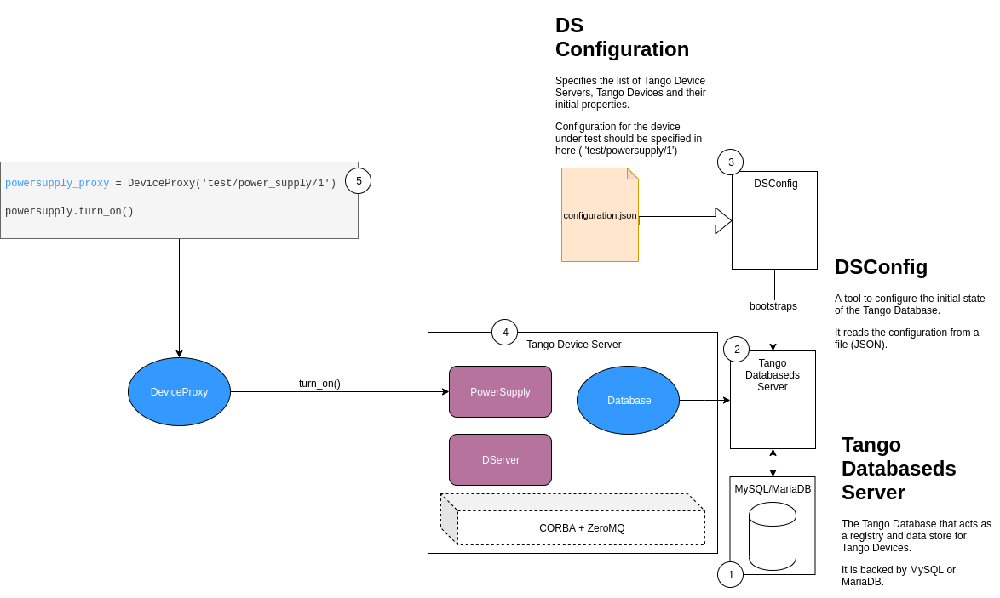
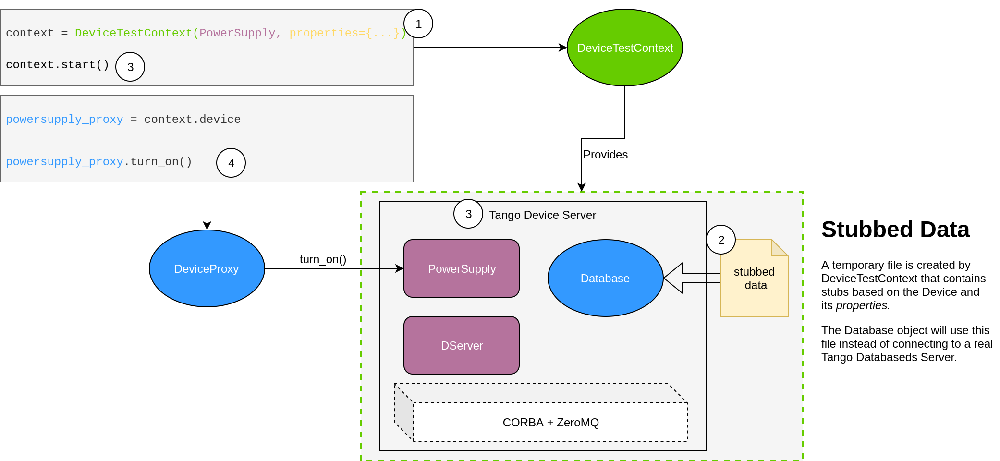
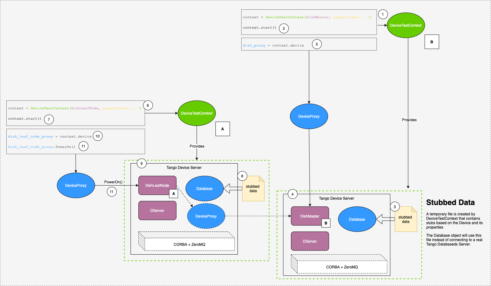
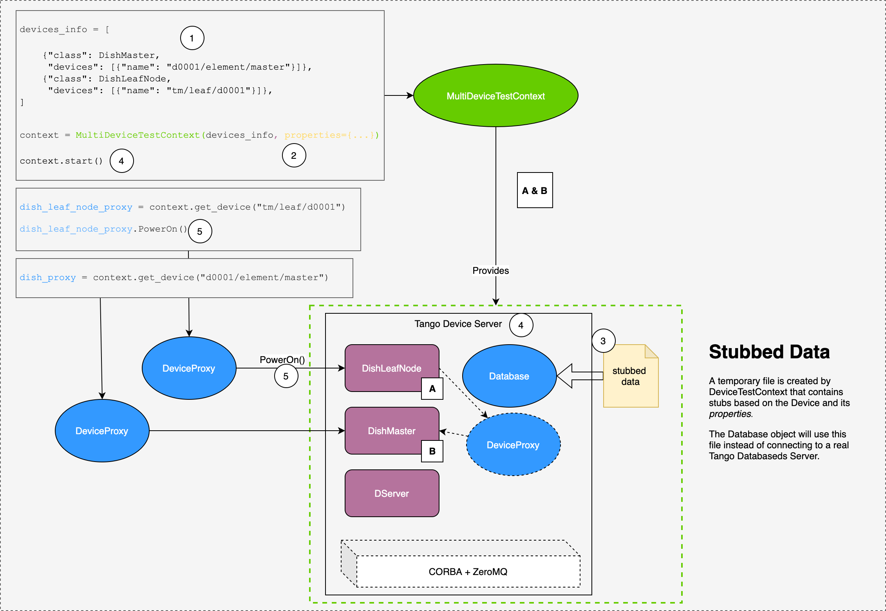

.. currentmodule:: tango

.. highlight:: python
   :linenothreshold: 3

.. _testing-approaches:

===================================
Approaches to testing Tango devices
===================================

Overview
--------

The follow sections detail different approaches that can be used when automating tests.  This includes starting the real devices as normal in a Tango facility, using the :class:`~tango.test_context.DeviceTestContext` for a more lightweight test, a hybrid approach mixing :class:`~tango.test_context.DeviceTestContext` and real Tango devices in a Tango facility, and starting multiple devices with the :class:`~tango.test_context.DeviceTestContext` and :class:`~tango.test_context.MultiDeviceTestContext`.

Testing a single device without DeviceTestContext
^^^^^^^^^^^^^^^^^^^^^^^^^^^^^^^^^^^^^^^^^^^^^^^^^

.. note::  This approach is not recommended for unit testing.

Testing without a :class:`~tango.test_context.DeviceTestContext` requires a complete Tango environment to be running (this environment is orchestrated by Makefiles and Docker containers in our Tango Example repo). That is, the following four components/processes should be present and configured:

  * DSConfig tool
  * Tango Databaseds Server
  * MySQL/MariaDB
  * Tango Device Server (with Tango device under test inside it)

In order to successfully constitute a working Tango environment, the following sequence of operations is required:

  1. A running MySQL/MariaDB service.
  2. The Tango Databaseds Server configured to connect to the database.
  3. The DSConfig tool can be run to bootstrap the database configuration of the Tango Device based on configuration from a file.
  4. The Tango Device Server that has been initialised and running the Tango Device.
  5. In the test, you can instantiate a PyTango DeviceProxy object to interact with the Tango device under test.

This is a lot of infrastructure and complicated to orchestrate - it is not conducive to lightweight, fast running unit tests.  Thus it is not recommended.

Figure 1. A schematic diagram showing the agents involved when testing a Tango device using the real Tango database and their interactions.

Examples:

  * `test_2_test_server_using_client.py <https://gitlab.com/ska-telescope/tango-example/-/blob/b20a0b44b4d3499188ffb60e390adab7132fc3a3/post-deployment/tests/test_2_test_server_using_client.py>`_
  * `test_3_test_motor_server.py <https://gitlab.com/ska-telescope/tango-example/-/blob/b20a0b44b4d3499188ffb60e390adab7132fc3a3/post-deployment/tests/test_3_test_motor_server.py>`_
  * `test_4_test_event_receiver_server.py <https://gitlab.com/ska-telescope/tango-example/-/blob/b20a0b44b4d3499188ffb60e390adab7132fc3a3/post-deployment/tests/test_4_test_event_receiver_server.py>`_

Testing a single device with DeviceTestContext
^^^^^^^^^^^^^^^^^^^^^^^^^^^^^^^^^^^^^^^^^^^^^^

A utility class is provided by PyTango that aids in testing Tango Devices. It automates a lot of the operations required to start up a Tango runtime environment.::

    from tango.test_context import DeviceTestContext

The :class:`~tango.test_context.DeviceTestContext` accepts a Tango Device Python class, as an argument, that will be under test (PowerSupply). It also accepts some additional arguments such as properties - see the method signature of :class:`~tango.test_context.DeviceTestContext` constructor.
It will then do the following:
Generate stubbed data file that has the minimum configuration details for a Tango Device Server to initialise the Tango Device under test (PowerSupply).
It will start the Tango Device Server that contains the Tango Device (in a separate thread by default, but optionally in a subprocess).
DServer is a "meta" Tango Device that provides an administrative interface to control all the devices in the Tango Device Server process.
The DeviceProxy object can be retrieved from the DeviceContext and can be invoked to interact with Tango Device under test.
A DeviceProxy object will expose all the attributes and commands specified for the Tango Device as Python objects, but invoking them will communicate with the real device via CORBA.  If events are used, these are transported via ZeroMQ.

Figure 2. A schematic diagram showing the agents involved when testing a Tango device using the :class:`~tango.test_context.DeviceTestContext` and their interactions.

You may now proceed to exercise the Tango Device's interface by invoking the appropriate methods/properties on the proxy:

+---------------------------------+-------------------+-------------------------------------------+
| **Example Code Snippet**        | **Tango Concept** | **Description**                           |
+---------------------------------+-------------------+-------------------------------------------+
| ``powersupply_proxy.turn_on()`` | Tango Command     | An action that the Tango Device performs. |
+---------------------------------+-------------------+-------------------------------------------+
| ``powersupply_proxy.voltage``   | Tango Attribute   | A value that the Tango Device exposes.    |
+---------------------------------+-------------------+-------------------------------------------+

Example:

* `test_1_server_in_devicetestcontext.py <https://gitlab.com/ska-telescope/tango-example/-/blob/b20a0b44b4d3499188ffb60e390adab7132fc3a3/post-deployment/tests/test_1_server_in_devicetestcontext.py>`_

Testing a single device with DeviceTestContext combined with a real device(s) using the Tango database
^^^^^^^^^^^^^^^^^^^^^^^^^^^^^^^^^^^^^^^^^^^^^^^^^^^^^^^^^^^^^^^^^^^^^^^^^^^^^^^^^^^^^^^^^^^^^^^^^^^^^^

This use case first requires the whole test infrastructure described in use case 1 above to be up before the tests can be run against the device (DishLeafNode) in the :class:`~tango.test_context.DeviceTestContext`. The following sequence of events occur to run rests against the device (DishLeafNode):

  * Set up the test infrastructure for the real device - DishMaster (all the steps defined for use case 1 above apply).
  * Set up the test infrastructure for the device (DishLeafNode) in the :class:`~tango.test_context.DeviceTestContext` (all steps in use case 2 above apply).
  * Create a proxy (dish_proxy) which exposes the attributes and commands of the real device to be tested.

    * There's a `proxy <https://gitlab.com/ska-telescope/tmc-prototype/-/blob/379257d60186814ec3746a7567d4fd90594bfca3/tmcprototype/DishLeafNode/DishLeafNode/DishLeafNode.py#L437>`_ in the provisioned :class:`~tango.test_context.DeviceTestContext` which knows about the real device but cannot expose its attributes and commands in that context, hence the need for the dish_proxy.

.. image:: ../_static/testing-approaches-hybrid.png

Figure 3.  A schematic diagram showing the agents involved when testing multiple Tango devices using the :class:`~tango.test_context.DeviceTestContext` together with the real Tango database and their interactions.

Examples:

  * `DishLeafNode/conftest.py <https://confluence.skatelescope.org/gitlab.com/ska-telescope/tmc-prototype/-/blob/379257d60186814ec3746a7567d4fd90594bfca3/tmcprototype/DishLeafNode/conftest.py#L79>`_

Testing with multiple DeviceTestContexts
^^^^^^^^^^^^^^^^^^^^^^^^^^^^^^^^^^^^^^^^

.. note::  This approach is not recommended - rather use :class:`~tango.test_context.MultiDeviceTestContext`.

The testing scenario depicted in Figure 3 can be implemented without using the real Tango database. In this use case, the underlying device (DishMaster) is provisioned using the :class:`~tango.test_context.DeviceTestContext`. Just like in the use case above, another proxy (dish_proxy) is created to expose the commands and attributes of the DishMaster Device. The sequence of events which take place to provision each of these DeviceTestContexts are exactly the same as described in use case 1.  This is not recommended because it can be done more easily using the :class:`~tango.test_context.MultiDeviceTestContext`, as shown in the next section.

Figure 4.  A schematic diagram showing the agents involved when testing multiple Tango devices using the :class:`~tango.test_context.DeviceTestContext` and their interactions.

Examples:

  * `Tango forum post <https://www.tango-controls.org/community/forum/post/3807/>`_

Testing with MultiDeviceTestContext
^^^^^^^^^^^^^^^^^^^^^^^^^^^^^^^^^^^

There is another testing class available in PyTango: :class:`~tango.test_context.MultiDeviceTestContext`, which helps to simplify testing of multiple devices.  In this case the multiple devices are all launched in a single device server.::

    from tango.test_context import MultiDeviceTestContext

The testing scenario depicted in Figure 4 can be implemented with just a single :class:`~tango.test_context.MultiDeviceTestContext` instead of two :class:`~tango.test_context.DeviceTestContext` instances (and still without using the real Tango database). In this use case, both devices (DishMaster and DishLeafNode) are provisioned using the :class:`~tango.test_context.MultiDeviceTestContext`. Just like in the use case above, another proxy (dish_proxy) is created to expose the commands and attributes of the DishMaster Device to the test runner. The sequence of events which take place to provision this MultiDeviceTestContexts is similar that use case 1.  The main difference is the devices_info the must be specified beforehand.  Here we can define the devices that must be started, their names, and initial properties.

Figure 5.  A schematic diagram showing the agents involved when testing multiple Tango devices using the :class:`~tango.test_context.MultiDeviceTestContext` and their interactions.

Examples:

* `MultiDeviceTestContext with fixtures <https://github.com/tango-controls/pytango/tree/develop/examples/multidevicetestcontext>`_

Issues
------

  1. The :class:`~tango.test_context.DeviceTestContext` is quite a heavyweight utility class in terms of the dependent components it needs to orchestrate so that testing can be done. It requires the Tango runtime, including ZeroMQ for events, and a Database stub file as a minimum.
  2. A single process that uses a :class:`~tango.test_context.DeviceTestContext` more than once in threaded mode (so not a subprocess, with kwarg ``process=True``), will get a segmentation fault.   With ``process=True``, we cannot access the internals of the class under test from the test runner - we have to use the Tango API via a DeviceProxy.
  3. Forwarded attributes do not work.
  4. There is no way to unit test (in the strict definition), since the Tango device objects cannot be directly instantiated.

Acknowledgement
---------------

Initial content for this page contributed by the `Square Kilometre Array <https://www.skatelescope.org>`_.

